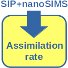

# LARS

**Look@Rates** - a Matlab script for calculating *substrate assimilation rates* in cells from their isotopic composition determined by nanoSIMS.

## Input data in a spreadsheet

Input data needs to be organized in a spreadsheet. A template spreadsheet is available in the folder *templates*.

The required data include the parameters listed in the table below. Each row corresponds to an individual cell.

| row  | explanation |
|-----:|:------------|
| t    | Duration of the SIP incubation. A value in *h* will yield rates in *h*-1.|
| x    | Best estimate of the 13C atom fraction of the measured cell, *x*. The value is determined from the nanoSIMS measurement. It can be exported by analyzing the nanoSIMS data with Look@NanoSIMS.|

