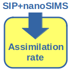

# LARS

**Look@Rates** is a Matlab function for calculating *substrate assimilation rates* in cells from their isotopic composition determined by nanoSIMS. The function implements calculation approaches described in the manuscript

- Polerecky et al. (2021) Calculation and interpretation of substrate assimilation rates in microbial cells based on isotopic composition data obtained by nanoSIMS. Submitted to *Frontiers in Microbiology*.

## Install Look@Rates

1. You need Matlab to run **Look@Rates**. The core Matlab binaries should be sufficient, no need for extra toolboxes.

2. Download ``lookatrates.m`` from the [matlab](matlab/) folder (see list of files above) and save it on your computer.

3. Create a subfolder called ``data`` in the same folder where you saved ``lookatrates.m``. This is where the input ``xlsx`` files are expected to be and where the output will be exported.

4. A faster approach may be to click on the green ``Code`` button (at the top of this page) and download the zip-file of the entire LARS project, including the Matlab code, documentation, and the template input spreadsheet.

## Input data

**Look@Rates** reads input data from a spreadsheet (``xlsx`` format). The required data are organized in columns, with rows corresponding to individual cells (see an example below). Description of the required data is provided in **Table 1** available in the folder [manual](manual/). A **template** spreadsheet (called ``DataCells1.xlxs``) is available in the [data](matlab/data) folder.

## Output data 

**Look@Rates** exports calculated rates as a new sheet (called ``rates``) in the input spreadsheet (``xlsx`` format). The output values are organized in columns, with rows corresponding to individual cells (see an example below). Description of the output data is provided in **Table 2** available in the folder [manual](manual/).

## Run Look@Rates

1. In Matlab, set the working directory to the folder where you saved ``lookatrates.m``.

2. In the Matlab command line, type ``lookatrates;`` (including the semi-colon) and press enter.

    This will execute the function with the following default values of the input paramers:

    - ``Input_file = 'DataCells1.xlsx'`` (name of the xlsx input file; the file is assumed to be in the ``data`` subfolder; see above)
    - ``Nsimul = 2000`` (number of Monte-Carlo simulations for each cell)
    - ``pause_for_each_cell=1`` (make a pause after calculating the rate for each cell; good for viewing the graphical results)
    - ``export_graphs_as_png=1`` (export calculation results as a PNG image)

3. If you want to change the input parameters, run the function as

    ``lookatrates(Input_file, Nsimul, pause_for_each_cell, export_graphs_as_png);``

    and specify the parameter values as you want. Use ``[]`` (i.e., an empty value) if you want to use a *default* value for a given input parameter. Examples of possible commands:
    
    ``lookatrates('DataCells2.xlsx');``

    ``lookatrates([], 5000, 1);``
    
    ``lookatrates('DataCells2.xlsx', [], [], 0);``

4. Alternatively, you can change the default values of the input parameters by editing the ``lookatrates.m`` file in the Matlab editor and then proceed as explained in point 2. The default values are specified on line 28 (or thereabout).

## Calculation approach

Consult the manuscript and **Table 1** ([manual](manual/)) to become familiar with the meaning of the different parameters and variables used in the description below. Note that the description assumes assimilation of carbon (C), but the calculation method is applicable to any other element. 

The general approach employed in **Look@Rates** is based on a Monte-Carlo method. It proceeds according to the following steps.

1. C content of the cell is calculated as C = &#961; &#183; V, uncertainty of the C content is calculated as &#916;C = &#961; &#183; &#916;V, and the average C content of the cell is calculated as &#10216;C&#10217; = &#961; &#183; &#10216;V&#10217;, where V, &#916;V, &#10216;V&#10217;, and &#961; are provided as input (see **Table 1**).

2. 13C atom fraction of the cell is sampled from a normal distribution: xj = N(mean=x, SD=&#916;x), where x and  &#916;x is provided as input (see **Table 1**).

3. C content of the cell is sampled from a normal distribution: Cj = N(mean=C, SD=&#916;C). 

4. The substrate-normalized 13C atom fraction of the cell is calculated as 

      xS,jE = (xj - xini) / (xS,eff - xini),

    where xS,eff is the effective 13C atom fraction of the substrate and xini is the initial 13C atom fraction of the cell (both provided as input; see **Table 1**).

5. The carbon-specific carbon assimilation rate (in h-1) is calculated as

    kj = -(1/t) &#183; ln(1-xS,jE)

    where t is the incubation time (provided as input; see **Table 1**).
    
6. The cell-specific carbon assimilation rate (in fmol C cell-1 h-1)  is calculated according to four approaches:

    **Approach A:** rj = kj &#183; &#10216;C&#10217; (later denoted as *avg-cell-cycle*)

    **Approach B:** rj = kj &#183; Cj (later denoted as *end-SIP*)

    **Approach C** (accounts for cell division): rj = Z-1(t, Cj, Cmax, xS,jE) (later denoted as *avg-SIP-div*)

    **Approach NON-DIV** (does not account for cell division): rj = (xS,jE &#183; Cj)/t (later denoted as *avg-SIP-nondiv*)

7. Steps 2-6 are repeated for N=``Nsimul`` randomly sampled values of xj and Cj, yielding N=``Nsimul`` values of predicted rates, rj. Mean and SD are calculated based on these values, separately for each calculation approach.

8. Results for the current cell are displayed and exported in a PNG file. Example is shown here:

    

    - The top-left graph shows the predicted substrate normalized 13C atom fraction, xSE, and cell cycle stage, s, of the cell as a function of time. Because both values are random variables, they are displayed as time-dependent histograms. That is, at a give time, the black and cyan band represents the probability distribution (in a log-scale) of predicted xSE and s values, respectively. The cell cycle stage is calculated from the C content of the cell as s=C/(Cmax/2)-1, where Cmax = &#10216;C&#10217; &#183; ln(2) &#183; 2. Binary cell division occurs when the C content of the cell reaches the critical value Cmax, i.e., when s reaches 1. After division, the C content of the cell is set to Cmax/2, i.e., s is set to 0.
    - The top-middle graph shows a scatter plot of the sampled pairs [xj, Cj] (see Steps 2-3 above).
    - The top-right graph shows a 2D-histogram of the sampled pairs [xj, Cj] (see Steps 2-3 above).
    - The bottom-left graph shows histograms of the initial (sini) and predicted final (send) cell cycle stage.
    - The bottom-middle graph shows a 2D-histogram of the predicted pairs [rj, sini,j], where rj is calculated according to Approach C.
    - The bottom-right graph shows histograms of r values predicted by the four approaches listed above (Step 6).

9. Steps 1-8 are repeated for all cells in the input file.

10. Mean and SD values of the calculated rates are exported. Consult **Table 2** ([manual](manual/)) for the description of the exported values.

## Important notes

1. If &#10216;C&#10217; is known but C is unknown, only Approach A is used to calculate r. This happens when the spreadsheet-cell ``avgVcell`` contains a positive value and the spreadsheet-cell ``Vcell`` is empty.

- If C is known but &#10216;C&#10217; is unknown, only Approach B and NON-DIV are used to calculate r. This happens when the spreadsheet-cell ``Vcell`` contains a positive value and the spreadsheet-cell ``avgVcell`` is empty.

- If both C and &#10216;C&#10217; are known, r is calculated by all approaches. This happens when both spreadsheet-cells ``Vcell`` and ``avgVcell`` contain a positive value.
